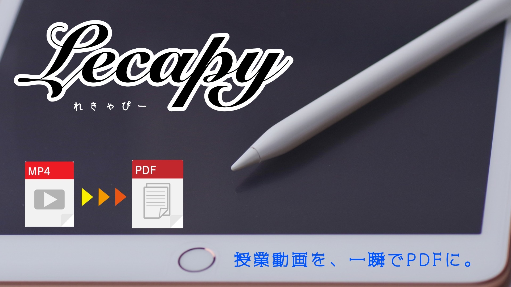

# Lecapy 

**Lecapy** converts a lecture video into a PDF file.

# DEMO

Heroku : [https://lecapy.herokuapp.com/](https://lecapy.herokuapp.com/)

Streamlit Sharing : [https://share.streamlit.io/kitsuya0828/lecapy/main/app.py](https://share.streamlit.io/kitsuya0828/lecapy/main/app.py)

